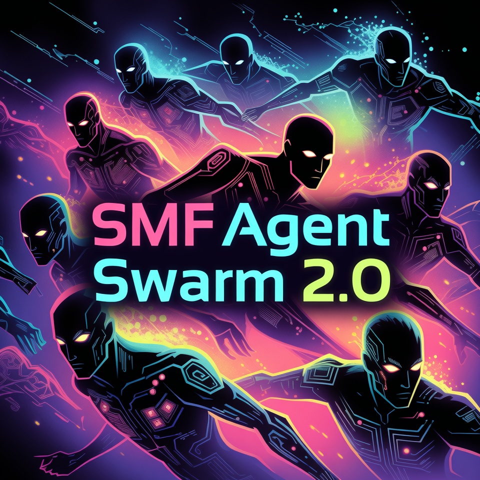
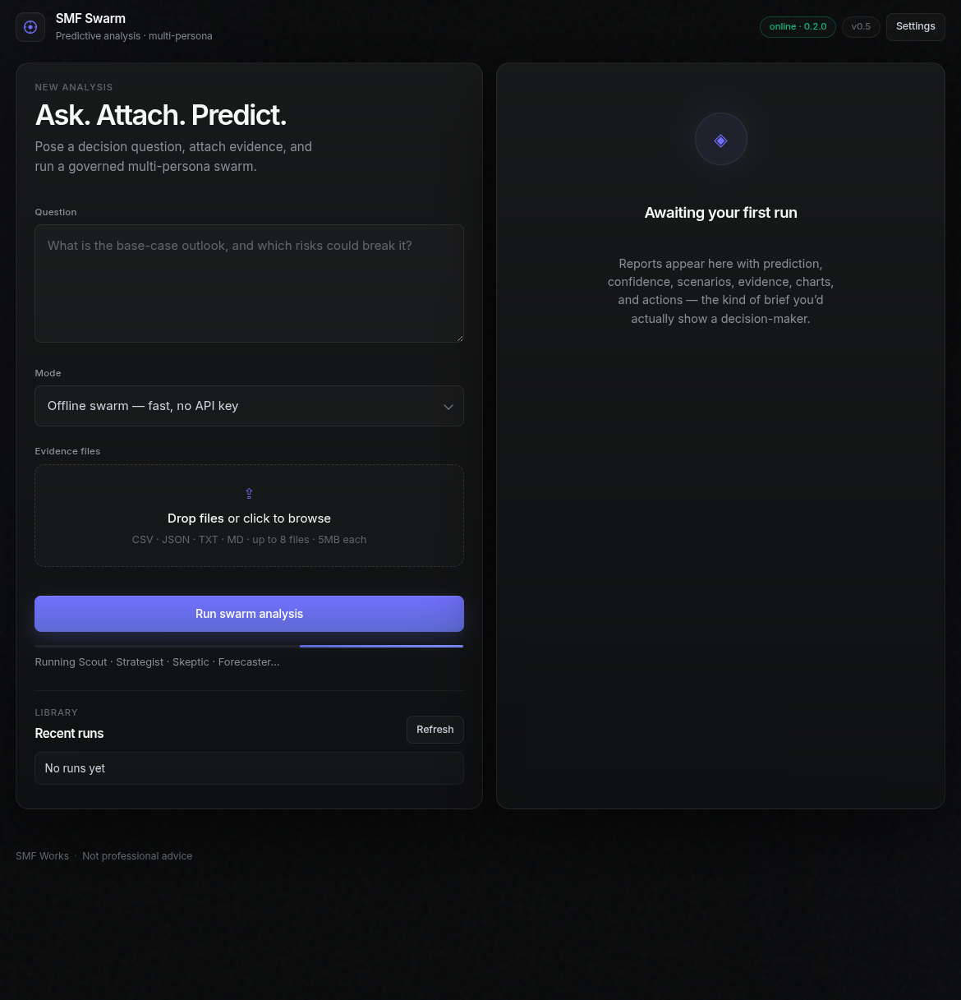

# SMF Swarm

<p align="center">
  
</p>

<p align="center">
  
</p>

**Governance-first predictive analysis app** — download, run, ask a question, attach data, get a multi-persona decision brief.

| | |
|--|--|
| **Version** | **0.5.0** |
| **Package** | `smf-swarm` |
| **Repo** | https://github.com/smfworks/smf-swarm-2.0 |
| **License** | MIT |

---

## Download & install

### Requirements

- Python **3.10+**
- Linux, macOS, or Windows

### 1. Clone

```bash
git clone https://github.com/smfworks/smf-swarm-2.0.git
cd smf-swarm-2.0
```

### 2. Create a virtual environment

```bash
python3 -m venv .venv
source .venv/bin/activate          # Windows: .venv\Scripts\activate
pip install -U pip
```

### 3. Install the app

```bash
pip install -e ".[app]"
```

### 4. Launch the UI

```bash
smf-swarm serve --host 127.0.0.1 --port 8787
```

Open **http://127.0.0.1:8787**

That’s the full product loop for end users.

> Full install guide (Settings, env vars, troubleshooting): **[INSTALL.md](INSTALL.md)**  
> Agent-oriented notes: **[AGENTS.md](AGENTS.md)**

---

## How to use (UI)

1. Enter a **decision / forecasting question**  
2. Optionally **attach evidence** (CSV, JSON, TXT, MD)  
3. Choose mode:  
   - **Offline swarm** — works with no API key (great first run)  
   - **LLM swarm** — open **Settings** (top right) → set Base URL + Model → Save / Test  
4. Click **Run swarm analysis**  
5. Read the report: prediction, confidence, scenarios, evidence, charts (CSV), risks, actions  
6. **Copy share link**, export Markdown/JSON, or reopen a run from **Recent runs**

### Sample data included

```text
fixtures/sample_growth.csv
```

Attach it and ask:

> Given this signup and churn trend, what is the near-term growth outlook and top risks?

---

## How to use (CLI / agents)

### Headless analysis

```bash
smf-swarm analyze \
  -q "What is the base-case outlook and top risks?" \
  -d fixtures/sample_growth.csv \
  --mode mock \
  -o report.json
```

### LLM mode (CLI)

```bash
export SMF_SWARM_LLM_BASE_URL=http://YOUR-HOST:PORT/v1
export SMF_SWARM_LLM_MODEL=your-model-id
# optional: export SMF_SWARM_LLM_API_KEY=...
smf-swarm analyze -q "..." -d data.csv --mode llm -o report.json
```

### Capability diagnostic (library)

```bash
smf-swarm diagnose --fixture fixtures/skillopt_edit_planning_trajectories.json
```

---

## What you get

| Feature | Description |
|---------|-------------|
| **Premium dark UI** | Linear-inspired product surface (v0.5) |
| **Multi-persona swarm** | Scout · Strategist · Skeptic · Forecaster |
| **Evidence + methodology** | Citations, limitations, confidence |
| **CSV sparklines** | Auto charts from numeric series |
| **History + export** | Local run library, Markdown/JSON |
| **Share links** | Public read-only report pages |
| **Settings** | LLM Base URL / Model / API key in the browser |
| **Optional auth** | `SMF_SWARM_API_TOKEN` for analyze/history |
| **Governance** | Identity + hash-chained audit on analysis runs |
| **Phase 1 library** | Diagnostic + hooks (e.g. SkillOpt consumer) |

---

## Settings (LLM)

In the web UI: **Settings** (top right)

| Field | Purpose |
|-------|---------|
| Base URL | OpenAI-compatible endpoint, e.g. `http://host:8888/v1` |
| Model | Model id |
| API key | Optional; blank can use server env |

Saved in **browser localStorage**. Sent only when you **Run** (LLM mode) or **Test connection**.

Env fallbacks still work:

| Variable | Purpose |
|----------|---------|
| `SMF_SWARM_LLM_BASE_URL` | Default base URL |
| `SMF_SWARM_LLM_MODEL` | Default model |
| `SMF_SWARM_LLM_API_KEY` | Default API key |
| `SMF_SWARM_API_TOKEN` | Protect analyze/history if set |
| `SMF_SWARM_HISTORY` | Override history JSONL path |

---

## Verify

```bash
pip install -e ".[dev]"
pytest -q
smf-swarm analyze -q "Smoke test" -d fixtures/sample_growth.csv --mode mock
curl -s http://127.0.0.1:8787/api/health
```

---

## Documentation map

| Doc | Purpose |
|-----|---------|
| **[INSTALL.md](INSTALL.md)** | End-user download, run, Settings, troubleshooting |
| **[AGENTS.md](AGENTS.md)** | Agent install / operate notes |
| [`docs/PRODUCT_APP_v0.5.md`](docs/PRODUCT_APP_v0.5.md) | UI polish release notes |
| [`docs/PRODUCT_APP_v0.4.1.md`](docs/PRODUCT_APP_v0.4.1.md) | Settings UI |
| [`docs/PRODUCT_APP_v0.4.md`](docs/PRODUCT_APP_v0.4.md) | Charts, share, packaging |
| [`docs/PHASE1_STATUS.md`](docs/PHASE1_STATUS.md) | Living product + foundation status |
| [`docs/PHASE1_DOD.md`](docs/PHASE1_DOD.md) | Phase 1 definition of done |
| [`docs/CONSUMER_SKILLOPT.md`](docs/CONSUMER_SKILLOPT.md) | SkillOpt consumer path |
| [`docs/MOCK_VS_LLM.md`](docs/MOCK_VS_LLM.md) | Mock vs LLM policy |

---

## Notes

- Default analysis mode is **mock** (no network required).  
- Outputs are **decision support**, not professional advice.  
- Repo is currently private; install via Git clone as above.  
- Keep docs in lockstep when changing CLI / API / UI.

## License

MIT — SMF Works
